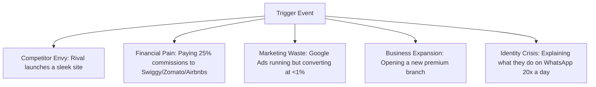

# B2B Sales Psychology Guide: Closing Premium Web Projects

This guide serves as a comprehensive B2B sales playbook for web design agencies, applying advanced sales psychology to local service businesses, cafes, boutique agencies, and independent service providers.

---

## 1. What Triggers a Business Owner to Buy a Website?

Business owners do not wake up thinking, "I need clean HTML/CSS code today." They buy a website when a specific **trigger event** occurs that forces them to act:



### Real-World Scenario (The Cafe Owner)
*   **The Status Quo:** A popular cafe (like *Babka Goa* or *Le Plaisir*) is packed daily. They rely on Instagram and Zomato. They are happy.
*   **The Trigger:** A new competitor opens down the road. This rival has a direct ordering website. Suddenly, the owner realizes they are losing high-margin delivery customers and paying 25% of their cake order revenues to aggregators. 
*   **The Pitch Angle:** You do not sell them "responsive grids." You sell them **commission independence** and **order control**.

---

## 2. The Five Biggest Fears Before Hiring a Freelancer

Clients are risk-averse. When buying a creative service, their brain actively searches for reasons to say "No" to protect their capital:

1.  **The "Ghosting" Fear (Reliability Risk):** Will this developer disappear halfway through the project or stop picking up my calls when bugs appear?
2.  **The "Money Hole" Fear (ROI Risk):** Will I spend ₹1,00,000 on a website that sits on the web and brings in exactly zero customers?
3.  **The "Tech Babble" Fear (Communication Risk):** Will they talk down to me in technical jargon (React, APIs, database latency) instead of explaining things simply?
4.  **The "Hostage Situation" Fear (Ownership Risk):** If I want to change a menu item price or salon photo later, will I have to pay them ₹5,000 and wait two weeks for a simple update?
5.  **The "Broken Promises" Fear (Quality Risk):** Will the final website look cheap, load slowly on mobile, and hurt my premium brand reputation?

---

## 3. The Psychology Behind Trust, Authority, and Pricing

Price is a psychological signal. It does not represent objective cost; it represents **inferred value** and **risk mitigation**:

```
High Price ➔ Low Risk + Premium Quality ➔ Peace of Mind
Low Price ➔ High Risk + Cheap Quality ➔ Constant Stress
```

### The Veblen Effect & Anchoring
*   **Cheap is Dangerous:** If you quote ₹15,000 for a website to a premium luxury wedding planner, they will reject you instantly. To them, a cheap price means you don't understand the luxury market, and you will damage their brand.
*   **Pricing Anchoring:** Always present three tiers. Anchor your premium tier high (e.g., ₹2,50,000) so your standard tier (e.g., ₹1,20,000) feels highly reasonable and low-risk.
*   **Authority Positioning:** Authority is established by asking deep business diagnostic questions, not by boasting about your skills. The doctor who diagnoses you thoroughly is the one you trust, regardless of their fee.

---

## 4. Value Positioning: Moving from "Coder" to "Growth Partner"

If you position yourself as a "web designer," you are treated as a commodity. You compete with Wix, Squarespace, and cheap freelancers on Fiverr. You must shift your positioning:

| The Commodity Freelancer (Costs Money) | The Agency Growth Partner (Makes Money) |
| :--- | :--- |
| Talks about frameworks, clean code, and SEO tags. | Talks about conversion rates, lead capture, and revenue margins. |
| Quotes by the hour or by the number of pages. | Quotes by the business outcome and value delivered. |
| "I will build you a 5-page WordPress site." | "I will build a customer booking funnel that saves you 2 hours of admin work daily." |
| Handled by the owner as a minor expense line. | Welcomed by the owner as an investment to grow sales. |

---

## 5. Uncovering the Client's Real Pain Points (The Diagnostic Approach)

To uncover pain points, use the **"5-Whys" diagnostic questioning method**. Don't accept the first answer they give you:

*   *Client:* "I need a new website."
*   *You:* "Why is now the right time to build a new one?"
*   *Client:* "Our current site is old." *(Surface Level)*
*   *You:* "Understood. When customers visit the current site, what is it failing to do that hurts the business?"
*   *Client:* "Well, they call us asking for our menu prices and availability because they can't find it easily." *(Operational Friction)*
*   *You:* "And how much time is your staff spending answering those basic WhatsApp calls instead of serving walk-in clients?"
*   *Client:* "At least 2 to 3 hours a day, especially during busy hours. It's chaotic." *(The Real Pain Point: Lost staff productivity and dropped calls)*

---

## 6. Selling Outcomes vs. Features: The Translation Grid

To close high-ticket deals, you must translate every technical feature into a concrete business outcome that the client cares about:

| Technical Feature | Business Translation (What the Client Buys) |
| :--- | :--- |
| **Mobile-responsive CSS Grid** | *"Your website will load perfectly on a customer's phone while they are stuck in traffic, making it easy for them to click 'Book Session' instantly."* |
| **Next.js static regeneration** | *"The site loads in under 1.5 seconds. For every second a site is slow, 20% of Google searchers leave. This feature directly lowers your Google ad waste."* |
| **Custom admin panel dashboard** | *"You can change menu prices, update portfolio images, or add new services in 3 clicks, without ever paying a developer to do it."* |
| **Integrated booking/payment engine** | *"Instead of playing phone tag to book appointments, clients pay a non-refundable deposit upfront, eliminating no-shows."* |

---

## 7. Common Objections and How to Handle Them

### Objection A: "You are too expensive. I can get this on Wix/Fiverr for ₹10,000."
*   **Psychology:** The client sees your website as a cost, not an investment. They don't understand the difference in quality.
*   **The Script:**
    > *"I completely understand. If you just want a digital brochure that sits online, Wix or a Fiverr template is a cheap option. But a generic template won't integrate your booking system, won't load fast enough to convert Google search ads, and will charge you transactional fees. 
    > 
    > We don't just build pages; we build a customer-acquisition engine. If our system saves your staff 2 hours of WhatsApp coordination daily and captures 5 extra bookings a week, the site pays for itself in less than 3 months. Do you want a cheap expense, or an asset that pays you back?"*

### Objection B: "We already get all our business from Instagram and Google Maps."
*   **Psychology:** The client feels safe on social media and doesn't see the risk of renting space on someone else's platform.
*   **The Script:**
    > *"Instagram is fantastic for visibility. But when a customer finds you on Instagram, their next step is searching for a menu, direct booking slot, or custom package pricing. Right now, you are forcing them to message you on DM, play phone tag, or search for you on Zomato/OTAs where they see your competitors. 
    > 
    > A website doesn't replace Instagram; it captures the warm leads Instagram creates and closes them automatically without you lifting a finger. Shall we capture that traffic directly?"*

### Objection C: "I need to think about it / let me discuss with my partner."
*   **Psychology:** The client is hesitating due to hidden fear (usually risk or budget).
*   **The Script:**
    > *"Totally fair. It's an important decision. Usually, when clients want to think about it, it means they are worried about the return on investment, the timeline, or how much effort it will take from their side. 
    > 
    > To make sure you and your partner have the right details—which of those areas is causing the hesitation?"*

---

## 8. The Top 1% Sales Close Questions

Ask these diagnostic questions during your discovery sessions to position yourself as an authority and steer the client toward a close:

1.  *"If we build this website and 6 months from now we look back, what specific business goal does it need to hit for you to consider this a home run?"*
2.  *"Right now, when a potential customer searches for your services on Google, what is the exact journey they take to book you? Where do you think you're losing them?"*
3.  *"How much is a single new customer worth to your business over their lifetime?"*
4.  *"What is the biggest operational bottleneck your staff faces when managing bookings/orders right now?"*
5.  *"If we don't fix this website issue now, how much revenue do you estimate is slipping through the cracks each month?"*

---

## 9. Emotional and Logical Factors in Purchase Decisions

Humans buy emotionally, then justify their decisions logically. You must feed both sides of the brain:

```
                  ┌───────────────────────────────┐
                  │      THE CLIENT'S BRAIN       │
                  └───────────────┬───────────────┘
                                  │
         ┌────────────────────────┴────────────────────────┐
         ▼                                                 ▼
┌─────────────────────────────────┐       ┌─────────────────────────────────┐
│     EMOTIONAL BUYING SIDE       │       │      LOGICAL BUYING SIDE        │
│    (What drives the action)     │       │    (What justifies the action)  │
├─────────────────────────────────┤       ├─────────────────────────────────┤
│ • Status: Prestige among peers  │       │ • ROI: Direct commission savings│
│ • Envy: Outperforming rivals    │       │ • Time: Admin hours saved       │
│ • relief: Less admin stress     │       │ • Security: SSL, full backup    │
│ • Trust: Relatability/Authority │       │ • Proof: Client case studies    │
└─────────────────────────────────┘       └─────────────────────────────────┘
```

---

## 10. Step-by-Step Agency Sales Framework

```
[Outreach DM/Email] ➔ [15-Min Discovery Call] ➔ [Mockup Demo Call] ➔ [Outcome Proposal] ➔ [Closing]
```

### Step 1: The Micro-Hook Outreach (DMs/Emails)
Keep it under 4 sentences. Focus on a single gap, prove value, and end with a low-friction question:
> *"Hi [Name]! Love your work at [Location]. I noticed your Instagram profile links to a third-party app menu which charges commission on bookings. I designed a quick, commission-free 'direct booking' website mockup for your brand. Mind if I send you the preview link here?"*

### Step 2: The Discovery Call (15 Mins)
Do **not** pitch your services here. Your only goal is to ask questions and diagnose the client's current situation:
*   "What is your current booking/order volume?"
*   "How are you managing those bookings currently?"
*   "What is the biggest headache you face in this process?"
*   "What are you hoping a new website will solve?"

### Step 3: The Mockup Demo Call (30 Mins)
This is where you show them the layout. Do not show them an empty wireframe. Show them a gorgeous, highly visual mockup featuring **their own branding, photos, and colors**. 
*   *Psychology:* When they see their own logo and cafe pictures on a modern, premium design, they feel emotional ownership. The website becomes real to them.

### Step 4: The Outcome-Based Proposal
Send a simple proposal. Instead of listing deliverables like "HTML coding, CSS styling, SEO configuration," list them as outcomes:
*   *Phase 1: Brand Positioning & UI Design* (Making your business look like the premium choice).
*   *Phase 2: Custom Booking Engine Integration* (Saving your team 2+ hours of admin work daily and eliminating no-shows).
*   *Phase 3: Page Speed & Search Optimization* (Ensuring you convert Google ad spend into paying clients).

### Step 5: The Close
Do not ask "Should we do this?" Ask a logical next-step question:
> *"Based on the mockup, we can have the booking system live before your busy weekend rush next month. To get started, I just need your logo assets and brand colors. Shall I send over the invoice for the 50% kick-off deposit?"*
